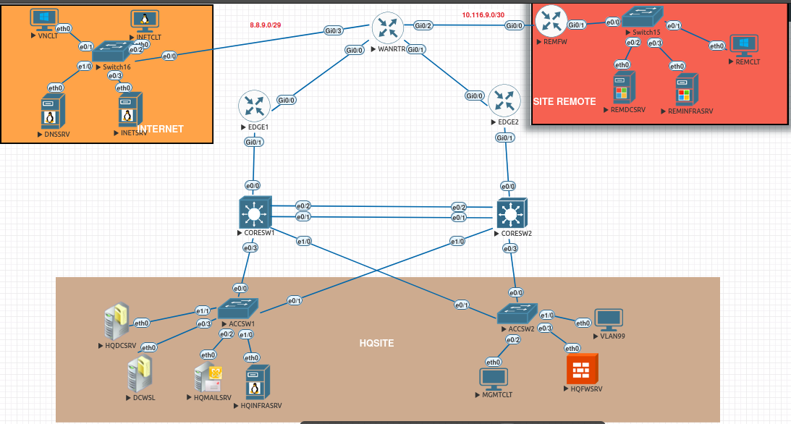

# 🏷️ SAE – Network Infrastructure Deployment  
### 🌐 WorldSkills-inspired IT Network Systems Administration Project

  

---

## 🎯 Project Overview

This repository documents a **network infrastructure deployment project** carried out as part of a **SAE (Situation d’Apprentissage et d’Évaluation)** inspired by the **WorldSkills France – IT Network Systems Administration (Lyon 2024)** competition.

The **architecture and design were provided in the subject**, and our objective was to **deploy, configure, validate and manage the infrastructure**, following professional standards and real-world constraints.

---

## 🧑‍💻 My Role

I was mainly responsible for the **deployment of the network backbone**, including:

- Implementation of the **IP addressing plan**
- Internal and external routing (**OSPF & BGP**)
- Use of **VRFs** to ensure full separation of internal and extended networks
- Configuration of **NAT / PAT** for Internet access and VPN connectivity
- Validation of the full architecture using **EVE-NG**
- Design of **Ansible playbooks** for network equipment management and monitoring

---

## 🤝 Team Collaboration

This project was carried out as a team, with clearly defined responsibilities:

- Switching infrastructure and remote site deployment  
- Active Directory services  
- VMware ESXi deployment for the headquarters  
- DMZ configuration and Internet connectivity  

This organization closely reflected a **real enterprise IT project**.

---

## 🏗️ Technologies Used

- **EVE-NG** – network simulation
- **Cisco IOS**
- **OSPF / BGP**
- **VRF**
- **NAT / PAT**
- **Ansible**
- **Enterprise LAN/WAN architecture**

---

## 🧠 Skills Developed

- Deployment of enterprise-grade LAN/WAN infrastructures  
- Routing and traffic segmentation using VRF  
- Secure Internet and VPN connectivity  
- Infrastructure validation in simulated environments  
- Network automation and supervision with Ansible  
- Technical documentation and operational procedures  

---
# 🔗 Resources

- 🖥️ **EVE-NG lab**: topology and configs available in this repository  
- 📄 **IP addressing plan**: `/addressing`  
- ⚙️ **Network configurations**: `/configs`  

---

## 📣 Internship Search

I am currently looking for a **16-week internship in Networks & Systems**, starting **February 9th, 2026**.

---

## 🙏 Acknowledgements

Thanks to our professors and supervisors for their guidance and for providing a learning environment inspired by **WorldSkills standards**.
